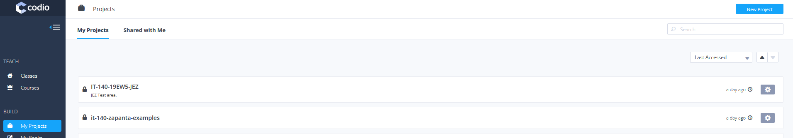
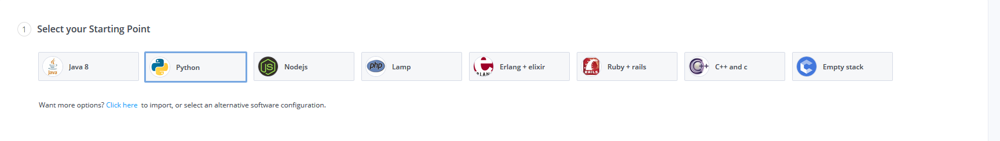
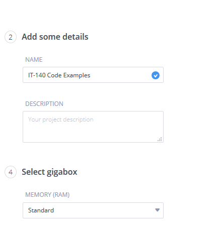
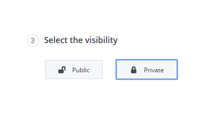
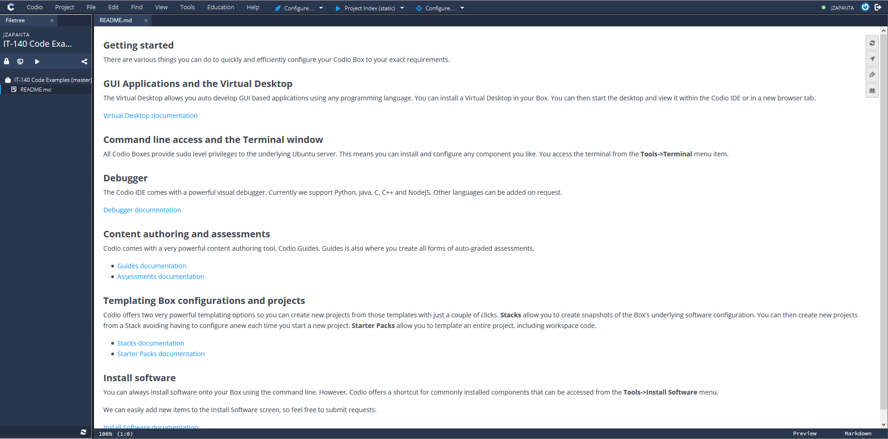

# IT-140 Examples by Javier Zapanta.
This repository holds relevant code samples for IT-140 at SNHU.  Folders will identify the appropriate module.

This repository is an extra resource and should be used in conjunction with the official textbook for the course that is housed in Codio.

# Accessing Code
To access the code in the Codio environment, follow this procedure:

## Step 1:  Get GitHub Clone URL
You will be [cloning](https://www.atlassian.com/git/tutorials/setting-up-a-repository/git-clone) the GitHub repository that contains the example files.  For reference, the URL is:

`<code>`https://github.com/jzapanta-snhu/it-140-zapanta-examples.git

## Step 2:  Create a Codio Project
In Codio, you have the ability to create individual projects.  To create a project:

### Initiate New Project
Click on **My Projects** and click on **New Project** to start the process.

### Select Environment
Make sure that you have selected Python as your project type.

### Enter Project Information
Enter a project name for the required **NAME** field.  A good project name can be:  *IT-140 Examples*

### Select Visibility
Set your project to **Private**.

### Create Project
Click **Create** to complete the process.  You will be taken the project area once created.

The project will have a single README file.

## Step 3:  Clone the project
To clone the project click on **Tools > Terminal**.  Once there, enter the following command:

`<code>`git clone https://github.com/jzapanta-snhu/it-140-zapanta-examples.git`</code>`
