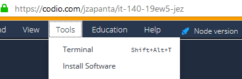

# IT-140 Examples by Javier Zapanta.
This repository holds relevant code samples for IT-140 at SNHU.  Folders will identify the appropriate module.

This repository is an extra resource and should be used in conjunction with the official textbook for the course that is housed in Codio.

# How to Use the Sample Code
The programs contained within the GitHub repository is for reviewing concepts.  You can enter the code into Codio by hand or you can download the code.  The procedure below is designed to use Git to pull code from GitHub.

# Accessing Code
To access the code in the Codio environment, follow this procedure:

## Step 1:  Get GitHub Clone URL
You will be [cloning](https://www.atlassian.com/git/tutorials/setting-up-a-repository/git-clone) the GitHub repository that contains the example files.  For reference, the URL is:

`https://github.com/jzapanta-snhu/it-140-zapanta-examples.git`

## Step 2:  Create a Codio Project
In Codio, you have the ability to create individual projects.  To create a project:

### Initiate New Project
Click on **My Projects** and click on **New Project** to start the process.

### Select Environment
Make sure that you have selected Python as your project type.

### Enter Project Information
Enter a project name for the required **NAME** field.  A good project name can be:  *IT-140 Examples*

### Select Visibility
Set your project to **Private**.

### Create Project
Click **Create** to complete the process.  You will be taken the project area once created.

The project will have a single README file.

## Step 3:  Clone the Sample Code
To clone the project click on **Tools > Terminal**.  

Once there, enter the following command:

`git clone https://github.com/jzapanta-snhu/it-140-zapanta-examples.git`

This copies the remote GitHub repository to your drive and you can test out the code.

## Step 4:  Running Sample Code
To run the code, try the following procedure within the Terminal window:

`cd ~/workspace/it-140-zapanta-examples/module01/`

`python3 01_hello.py`

This will change as you run other scripts.

## Step 5:  Update the repository
As updates get made to the repository, you will want to download the latest version of the code.  To do this, run the following commands:

`cd ~/workspace/it-140-zapanta-examples`

`git pull`

# Next steps
At this point, you have enough to try out code examples.  If you have any questions, please feel free to post a question under "General Questions" on
Brightspace.
